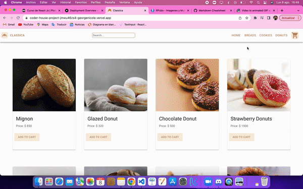

# Ecommerce CLASSICA

An Ecommerce based on a bakery has been created.

# Classica

CLASSICA seeks to reach those people who may not have time to go to a bakery or prefer to order online because it is more convenient for them.

## To install all dependencies

You can install it from npm

`$ npm install project-class2`

Or by cloning the repository

`$ git clone url`

## To start the project

`$ npm run start`

## Libraries used

Material ui has been used for the styles.
Sweetalert2 has been used to style the alerts.
React Spinners has been used to add a loader to the project.

## How to contribute?

You can create a pull request to the project
